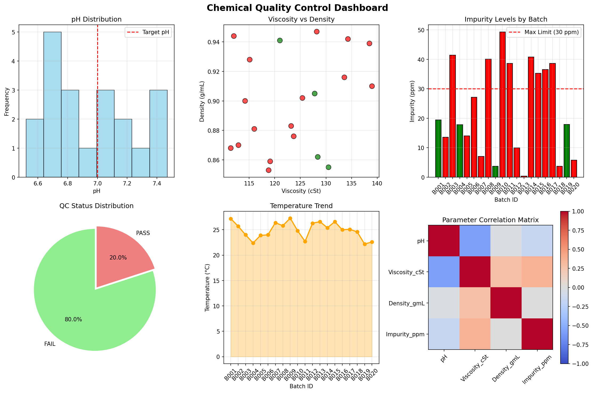

# 🧪 Lab Data Automation

Automated chemical lab data analysis and quality control dashboard using Python.

## 🚀 Features
- Chemical data generation and simulation
- Quality Control (QC) statistical analysis
- Automated Excel report generation
- Visual dashboard with Matplotlib

## 📊 Sample Output

## 🛠️ Technologies
- Python 3.12
- Pandas (Data analysis)
- Matplotlib (Visualization)
- Openpyxl (Excel integration)

## 👨‍🔬 About the Creator
- **Name:** Iim
- **Background:** D3 Analisis Kimia + R&D Pelumas
- **Mission:** Combining chemistry expertise with programming for lab automation

## 📈 Project Status
✅ Phase 1: Basic dashboard completed  
🔧 Next: Integrate real lab data and advanced analytics

---
*"From chemical formulas to Python functions – automating the lab of tomorrow."*
